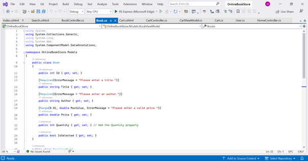

# Online Book Store

This repository contains an **Online Book Store** developed using the **ASP.NET MVC framework**.

## Context

The **Online Book Store** aims to help beginners understand the fundamental concepts of the MVC architecture practically. It demonstrates the roles of the **Model**, **View**, and **Controller**—how the Controller interacts with the Model and provides the requested View.

## Table of Contents
- [Context](#context)
- [Overview](#overview)
- [Theory](#theory)
  - [Introduction to MVC](#introduction-to-mvc)
  - [Role of Each MVC Component](#role-of-each-mvc-component)
  - [Benefits of MVC](#benefits-of-mvc)
- [Practical](#practical)
  - [1. Controllers](#1-controllers)
  - [2. Models](#2-models)
  - [3. Views and HTML Helpers](#3-views-and-html-helpers)
  - [4. Data Annotations and Validation](#4-data-annotations-and-validation)
- [Application Demonstration](#application-demonstration)

## Overview

**Scenario:**  
You have been tasked with developing an online bookstore website using the **MVC (Model-View-Controller)** architecture. The website allows users to browse, search, and purchase books while ensuring proper data validation and user input handling.

## Theory

### Introduction to MVC

#### Concept and Advantages  
MVC (**Model-View-Controller**) is a software architectural pattern that separates an application into three main components:
- **Model:** Manages data and business logic.
- **View:** Handles the presentation layer.
- **Controller:** Acts as an intermediary between Model and View.

Advantages of MVC:
- **Separation of Concerns:** Improves code organization and maintainability.
- **Modularity and Reusability:** Promotes clean, reusable components.
- **Enhanced Testability:** Simplifies independent unit testing.
- **Improved Collaboration:** Enables parallel development by separating responsibilities.

### Role of Each MVC Component

- **Model:** Manages data, database interactions, validation, and business rules.
- **View:** Handles the user interface, rendering data for display, and capturing user input.
- **Controller:** Directs the application flow, processing user input, updating Models, and returning appropriate Views.

### Benefits of MVC

- **Separation of Concerns:** Clear division of responsibilities simplifies maintenance and debugging.
- **Code Reusability:** Modular components can be reused across applications.
- **Testability:** Independent testing ensures robust functionality.

## Practical

### 1. Controllers

- **BookController:** Manages actions like listing books, searching, and adding to the cart.  

**Examples:**  
- `Index` action method: Retrieves books and displays them in the view.  
    
- `Search` action method: Filters books based on title or author.  
    
- `AddToCart` action method: Adds selected books to the cart.  
  

### 2. Models

- **Book Model:** Represents book details with properties and data annotations for validation.  
    
- **Cart Model:** Holds selected books and total price.  
  

### 3. Views and HTML Helpers

- **Index.cshtml:** Displays available books in a table.  
    
- **Search.cshtml:** Provides a search form for books.  
    
- **Cart.cshtml:** Displays selected books and total price.  
    
- **HTML Helpers:** Used for generating form elements like text boxes and dropdowns.  
  

### 4. Data Annotations and Validation

- Apply data annotations to validate book details and user inputs.  
    
- Use server-side validation with `ModelState.IsValid`.  
  

## Application Demonstration

1. **Home Page:**  
   

2. **Add Books to Cart:**  
   

3. **View Cart:**  
   

4. **Remove Books from Cart:**  
   

5. **Search for Books:**  
   

6. **Final Cart:**  
   

Users can also register and log in to manage sessions. Books added to the cart are saved per user session.